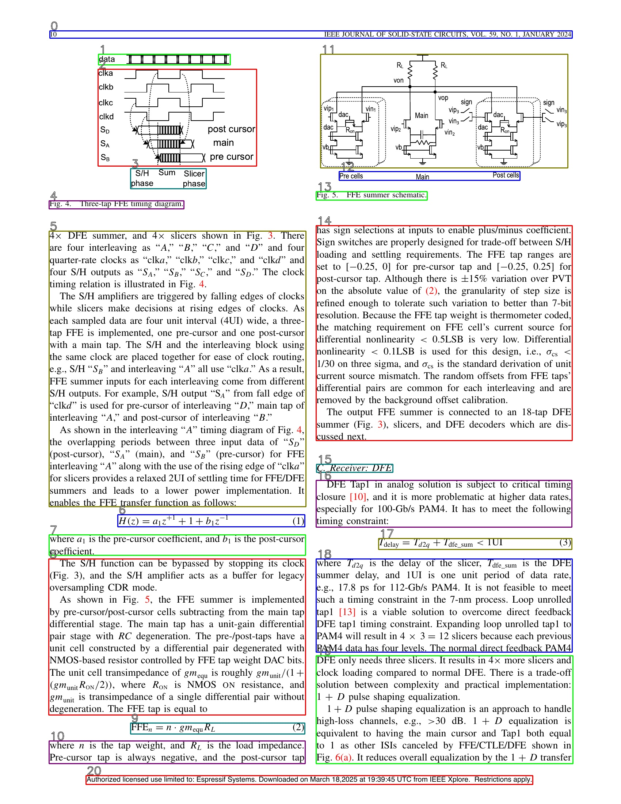

# INSTALLATION 

This was developed for a Mac operating system. If you need run this on other systems, follow the principles of "Make It Yourself Revolution". 

Install Python 3.12. Then navigate to the `segment_ocr` directory and run: 

`pip install -r requirements.txt`

You also need tesseract. Install `brew` if you don't have it:

`/bin/bash -c "$(curl -fsSL https://raw.githubusercontent.com/Homebrew/install/HEAD/install.sh)"`

`brew install tesseract`

Getting Gemma3:
1. Install Ollama on your computer. 
2. Run this command:
       ollama run gemma3:27b

# USAGE
To convert a PDF to markdown:
       python ieee2md.py <paper.pdf>

The output will be found in the outputs directory. The outputs include:
1. `text_*.md` which are the markdown files
2. `images_*.jpg` which are there for debugging purpose. You can turn it off if you don't need it. 
3. `fig*` the figures that are included in the markdown files. 

You can choose to use GPT4o or Gemma3 model. GPT4o gives more accurate transcription in general.  Gemma3 tend to do some strange things with the document headers and footers. It is not to do with font size or sampling rate. 

If you choose to use openAI's model, you will need to set environment:
`     setenv OPENAI_API_KEY <Your Key>`

To use Gemma3, you have to uncomment line that has `ask_gemma3` in ocr.py

`from ai_wrapper import ask_gpt as ask`

`#from ai_wrapper import ask_gemma3 as ask`

To use OpenAI, you have to uncomment line that has `ask_gpt` in ocr.py

`#from ai_wrapper import ask_gpt as ask`

`from ai_wrapper import ask_gemma3 as ask`

There are some magic numbers in the code that are tuned for IEEE papers, such as text densities. These were added to combat the occasional halluncination problem of Gemma3. 

If you wish to redo a certain page of the transcription, you can run 
`extract_with_text.py outputs/<desiredDir> <pageNum>`

# TODO
1. Concatenate the title of the papers. 
2. Fix the red-blue color swap (smurf) problem. 

# How it works
The script first partitions the page into rows and columns with a preference for column over row. The chunks are order from left to right, and from top to bottom. Only the coordinates of the boxes are saved in `bb*.txt`. 
A second script `extract_with_text.py` then reads in these coordinates, identify the text, figures and table, OCR if needed and reassemble the pages into markdown.  Below you see the ordering of the bounding boxes. 

